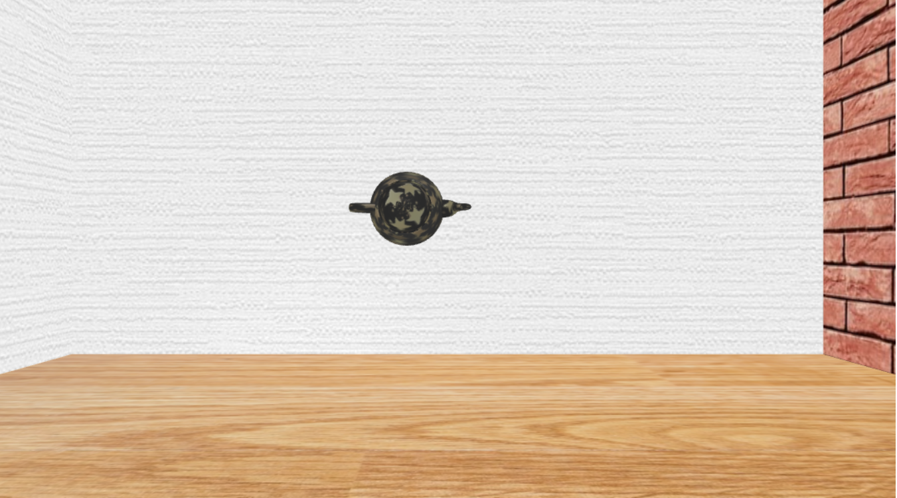
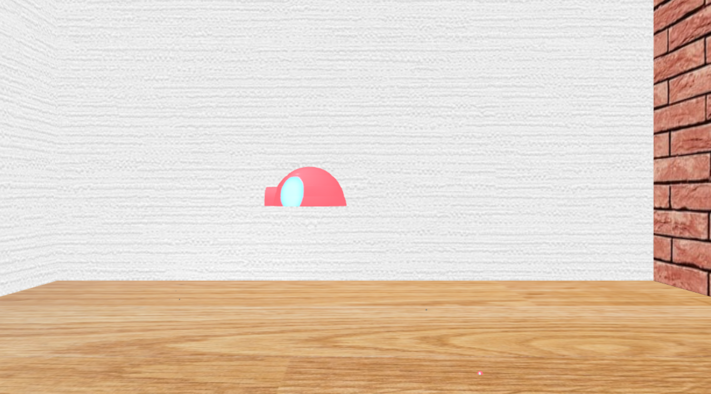

# Covid Rage Room

## Team 17: Nelson Truong, Aurora Yeh, Pompiliu Girlonta

### Introduction

Our project idea was to create a room with objects you could smash over and over. We’re basically taking the idea of a rage room (rooms that people pay to use to smash objects for anger therapy) but trying to implement it in a virtual environment. For starters, this means using multiple complex features, such as physics, collision detection, and a shattering effect of the initial object. The shattering effect would have yielded much potential if we could have expanded to using multiple different frameworks such as three.js or perhaps integrated Blender into tiny-graphics.js.

The inspiration for this came from different games, but primarily Garry's Mod served as an inspiration. In its ideal form, this demo would have included a plethora of features, like 
- sound effects
- more accurate physics for different object types with multiple parameters
    - friction coefficients
    - mass/density
- complex breaking and shattering of the 3D objects
- reflection coefficients for shiny materials
- etc.

However this would require the extensive use of a software like Blender to create and edit the models, especially when it comes to the breaking points.

What we see in the screenshots below are the inital setup of the room. We created the room using the Body class included in tiny-graphics.js. We downloaded some jpgs and formatted them all to be 512 x 512 pixels, then we imported them as textures and then added them to our materials class. After adding it to the Body class, we adjusted the ambience and the specularity, and lined it up. There were some initial issues where the walls were off by 1, so through trial and error we fixed them and lined them all up.

The second and third screenshots show the two different objects that can be broken by being thrown or dropped.

The GIFs show the actual dropping and throwing respectively, and the way the object randomly breaks and gets smaller and smaller. There were many different ways we could have implemented this but this was the most we could do before our hardware started introducting too much lagging.

### Advanced Features

#### Collision Detection

The collision detection uses the exact same function as the check_if_colliding() function from the Collision Demo. To check if an object, more specifically a Body object, is colliding with another, we treat both objects as ellipsoids and check if any points overlap. This function is used whenever a time step elapses to see if any objects have collided with a wall in the room. Depending on the wall it collides with, we can determine how to make the object “bounce” off in a realistic fashion.

Each Body object has several properties (shape, material, size, temporary, debris) that are defined when it is created. The temporary property determines what kind of object it is, for example, if a.temporary === U then it is not a wall. Each wall must make the objects bounce a certain direction when a collision is detected, so this property helps determine whether the object is bouncing off the floor, a certain wall, or the roof of the room.

The debris property is also used to determine if the object is a product of shattering. Once the primary object collides with the room, tinier objects are created to emulate debris. Each of these tiny objects should continue to collide with the room but do not create more debris.

#### Mouse Picking

Mouse picking was based on the teapot demo from week 7 Discussion 1B. First an event listener is added to the canvas that detects when the mouse is clicked (mousedown). The position of the mouse click is saved and scaled according to the bounding box to get coordinates within the range of -1 and 1, which is in NDCS. 

To convert coordinates from world space to NDCS, you left-multiply a vector by the camera inverse matrix (W) and then left-multiply the result by the projection transform matrix (P). Therefore, to get from NDCS back to world space, you multiply a vector in NDCS by (WP)-1.

An object is thrown from the center of the screen towards the position the mouse is clicked. To get the center of the screen, left-multiply (0, 0, 0, 1) by (WP)-1 and homogenize. To get the position the object is getting thrown towards, left-multiply (mouseX, mouseY, 1, 1) by (WP)-1 and homogenize. Subtracting the two vectors gets the initial_velocity vector, which can be scaled to change the throwing speed. In our code, the y-direction is reversed, so we had to negate that. 

To get the center position for where to create the object, take (WP)-1 and replace the upper left 3x3 matrix with the identity, turning it into a 4x4 translation matrix. 

### References

examples/collision_demo.js -  Used the Body, Simulation, and Collision Demo classes for reference
